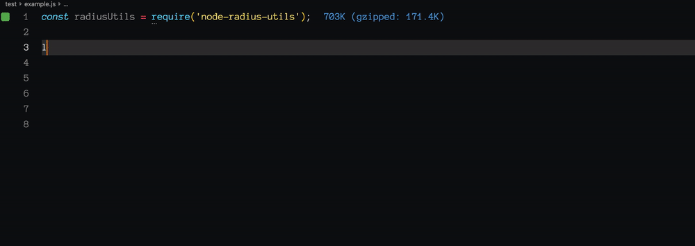

# Node Radius Utils

Utilities for working with radius in node. For use with libraries such as [node-radius](https://www.npmjs.com/package/radius#dictionaries).

* Includes all dictionary files from freeradius-server
* Typed locations of dictionary files
* Typed attributes for each dictionary
* Typed values for each dictionary
* Utility function to convert an object of attributes into an array of arrays



## Install

```sh
npm i node-radius-utils
```

## Usage

Usage with node-radius:

```js
const radius = require('radius'); // npm i radius
const {
  dictionaries: {
    all,
    rfc2865,
    nokia,
    freeradius_internal,
  },
  attributesToArray,
} = require('node-radius-utils');

// Use the default dictionary which includes all dictionary files.
// Resolves to node_modules/radius-utils/dictionaries/default
radius.add_dictionary(all.file);

// Use a specific dictionary
// Resolves to node_modules/radius-utils/dictionaries/dictionary.rfc2865
radius.add_dictionary(rfc2865.file);

// Use a specific dictionary
// Resolves to node_modules/radius-utils/dictionaries/dictionary.nokia
radius.add_dictionary(nokia.file);

const {
  values: {
    PACKET_TYPE,
  },
} = freeradius_internal;

radius.encode({
  code: PACKET_TYPE.ACCESS_REQUEST, // resolves to Access-Request
  secret: 'super-secret',
  attributes: attributesToArray({
    // resolves to Nas-Ip-Address
    [rfc2865.attributes.NAS_IP_ADDRESS]: '192,168.1.123',
    // resolves to User-Name
    [rfc2865.attributes.USER_NAME]: 'bob',
    // resolves to User-Password
    [rfc2865.attributes.USER_PASSWORD]: 'hunter2',
    // resolves to Calling-Station-Id
    [rfc2865.attributes.CALLING_STATION_ID]: 'AA:BB:CC:DD:EE:FF',
    // resloves to Nokia-Service-Name
    [nokia.attributes.NOKIA_SERVICE_NAME]: 'SuperService',
  }),
});
```
